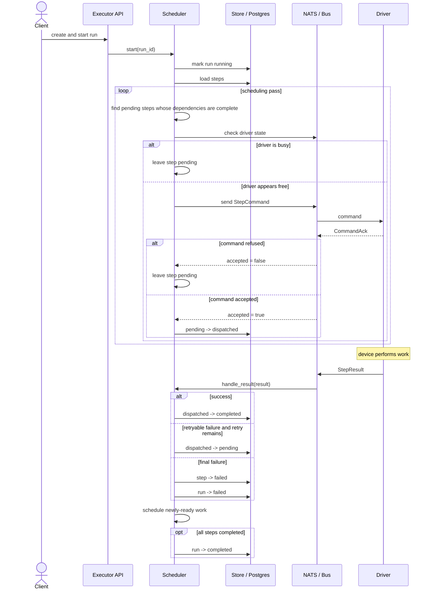
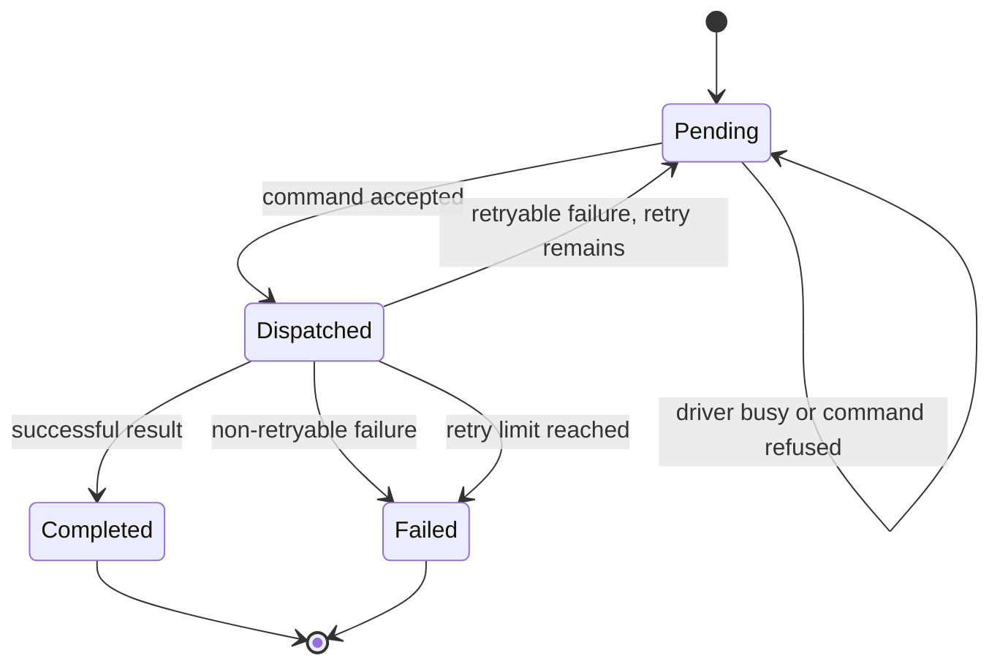
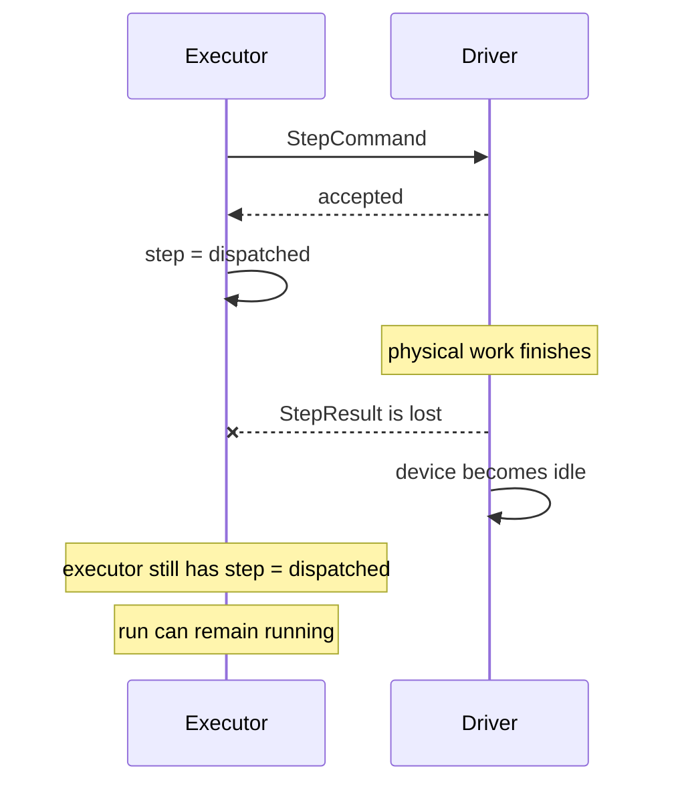

# Solution Walkthrough

This file complements the assignment `README.md`.

The README explains the system and the task. This file focuses on:

- what I implemented;
- how the final scheduler works;
- how the main requirements were checked;
- the two levels of extra testing I added;
- the main limitation that remains.

---

# 1. What the final solution does

The scheduler now has a simple flow:



The important rule is:

- **Executor/Postgres** owns the workflow state.
- **Driver** knows whether it is physically busy or free.
- `driver_state()` is a useful pre-check.
- `CommandAck` is still the final answer on whether a command was accepted.
- `StepResult` tells the executor how the physical work ended.

---

# 2. Step states



Extra safety checks in the scheduler:

- only `pending` steps can be dispatched;
- all dependencies must be `completed`;
- only one step per device is considered in one scheduling pass;
- one `asyncio.Lock` protects scheduler state changes;
- duplicate results are ignored;
- late results after a run has finished are ignored;
- retryable failures are limited to **two attempts total**.

---

# 3. How the assignment requirements were met

| Requirement | What I did | Proof / evidence |
|---|---|---|
| Respect the workflow DAG | A step is sent only when every dependency is complete. | Supplied acceptance tests for PCR Amplification and Triple Assay; additional completion test. |
| Run independent work in parallel | Ready steps on different devices can be dispatched in the same scheduling pass. | Supplied acceptance timing checks; timeline tool can show overlap. |
| Do not overload a busy device | Check `driver_state()` first and consider each device only once per scheduling pass. | Busy-device pytest tests; acceptance runs completed without avoidable busy refusals. |
| Handle a refused command | A refused command does not fail the run. The step stays `pending` and is tried again on a later scheduling pass. | Scheduler logic plus busy-device tests. |
| Handle step failure | Terminal failure marks the step and run as `failed`. | Supplied failure script plus added failure integration tests. |
| Make concurrent result handling safe | `asyncio.Lock` serialises scheduler state changes. | Supplied concurrency test. |
| Go beyond the minimum | Added bounded retries, duplicate/late-result handling, extra scheduler tests and live failure tests. | Pytest and bash test suites below. |
| Think about dropped results | Investigated and reproduced the case instead of hiding it. | `probe-dropped-result.sh`. |

---

# 4. Additional testing: two levels

The supplied tests are still the baseline.

I added two extra levels of testing because they answer different questions.

## Tier 1 — focused scheduler tests with pytest

These tests check scheduler logic quickly and in a controlled way.

Run:

```bash
docker compose run --rm tests
```

There are **8 tests in total**: one supplied concurrency test and seven additional tests.

| Test | What it checks |
|---|---|
| Supplied concurrency test | Two results arriving together do not cause the same next step to be dispatched twice. |
| `test_busy_device_is_not_commanded` | A device that reports `busy` is not sent another command. |
| `test_only_one_ready_step_per_device_is_sent_per_pass` | Two ready steps cannot both be sent to the same device in one scheduling pass. |
| `test_retryable_failure_is_retried_once_then_fails` | A retryable failure gets one retry, then stops instead of retrying forever. |
| `test_non_retryable_failure_fails_without_redispatch` | A non-retryable failure is not sent again. |
| `test_duplicate_result_is_ignored` | The same result arriving twice does not change state twice. |
| `test_late_result_after_failed_run_is_ignored` | A result arriving after the run failed does not reopen or change the run. |
| `test_run_completes_only_after_all_steps_complete` | A run cannot be marked complete while any step is still unfinished. |

Observed during development:

```text
8 passed
```

---

## Tier 2 — live integration tests with bash scripts

These tests use the real Docker services:

- executor;
- Postgres;
- NATS;
- simulated device workers.

| Script | What it checks |
|---|---|
| `scripts/acceptance.sh` *(supplied)* | Main happy path: correct order, completion, exactly-once behaviour and expected overlap. Run with both supplied workflows. |
| `scripts/check-failure.sh` *(supplied)* | Forces incubator failure and checks that the run fails instead of hanging. |
| `scripts/timeline.sh` *(supplied diagnostic)* | Shows when each device is busy so concurrency can be inspected. |
| `scripts/check-nonretryable-failure.sh` | Forces liquid-handler failure and checks that a non-retryable physical action is not repeated. |
| `scripts/check-terminal-step-failure.sh` | Lets all upstream work finish, then forces the final plate-reader step to fail and verifies the bounded retry. |
| `scripts/probe-dropped-result.sh` | Demonstrates the known dropped-result limitation. |
| `scripts/stress-random-failures.sh` | Runs several workflows with random failures and checks that they terminate cleanly without breaking dependencies or retry limits. |

Results seen during development:

- both supplied workflow acceptance runs passed;
- supplied failure check passed;
- all 8 pytest tests passed;
- deterministic added failure tests passed;
- dropped-result probe reproduced the expected limitation;
- a 10-run random-failure stress test completed with no dependency or retry-limit violations.

---

# 5. What remains unsolved

The main known limitation is a **dropped `StepResult`**.



This is different from a normal reported failure.

The executor knows that the command was accepted, but it does not know whether the lost result was:

- success, or
- failure.

So I did **not** automatically send the physical command again. For some lab operations, doing the same work twice could be unsafe.

The probe script proves this behaviour rather than hiding it.

A production solution would need things such as:

- stable command/result IDs;
- durable storage of results;
- a timeout or reconciliation process;
- a clear rule for which physical operations are safe to repeat.

There are two other limits worth noting:

- the `asyncio.Lock` protects only one executor process, not several replicas;
- the scheduler currently rescans running workflows when progress happens, which is simple but would need improvement at larger scale.

---

# 6. Scope of code changes

The scheduler solution itself stayed small:

- `services/executor/scheduler.py`
  - dependency-ready scheduling;
  - busy-device handling;
  - concurrency protection;
  - retries;
  - result handling;
  - run completion/failure.

- `services/executor/store.py`
  - one extra database transition to move a retryable step from `dispatched` back to `pending` without losing its dispatch count.

The other added files are tests and support scripts. The worker and bus protocol were not redesigned.

`docker-compose.debug.yml` is an optional local development override used to attach a VS Code debugger to the executor with debugpy; it is not required for normal execution or testing.
